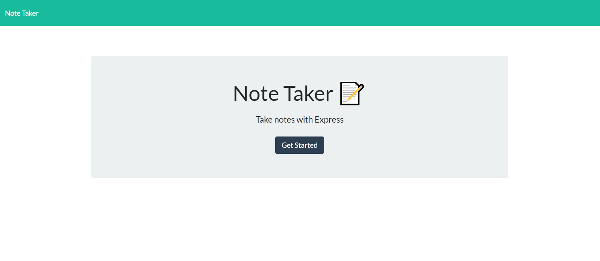
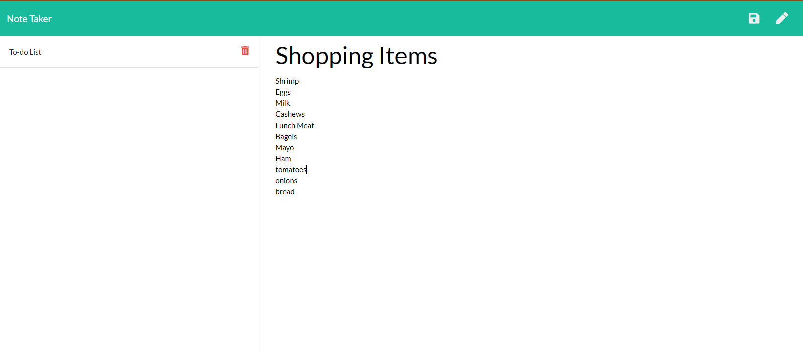

# Note Taker

## Table of Contents

* [overview](#overview)
* [Links](#links)
* [Screenshots](#screenshots)
* [Installation](#installation)
* [Technologies Used](#technologies)
* [Questions](#questions)

## overview

This application can be used to write, save, and delete notes. This application will use an express backend and save and retrieve notes data to and from a JSON file.

## Links

[See the Deployed Application](https://note-taker-32343.herokuapp.com/)

## Screenshots

## Installation Instructions

run "npm run install" in bash terminal to get package-lock.json and node_modules
run "npm init -y" and "npm run watch" activate local host
In your browser go to http://localhost:3000/

## Technologies Used

 Node, Express, nodemon, path, Js, CSS, HTML
 
## Questions

If you have further projects and questions, you can find me on Github: [GITHUB](https://github.com/benimahat1291). 
please visit my portfolio to find contact information: [BENI MAHAT](https://benimahat1291.github.io/Portfolio_v2/#/). 

